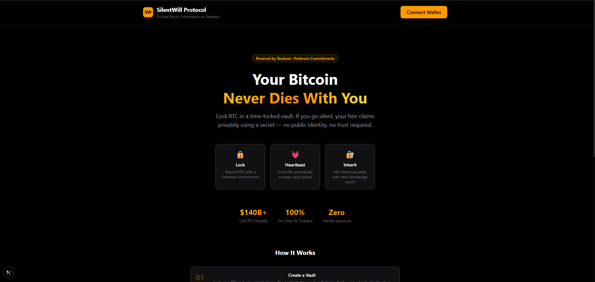

# 🔥 SilentWill Protocol

**Private Bitcoin Inheritance on Starknet**

> *Your Bitcoin never dies with you.* A zero-knowledge-inspired inheritance protocol using Pedersen commitments on Starknet — ensuring your crypto wealth passes to your heir privately, trustlessly, and autonomously.

[]() []() []()

---

## 🧠 The Problem

Over **$140 billion** in Bitcoin is estimated to be permanently lost — locked in wallets whose owners have died, lost their keys, or simply vanished. Traditional inheritance systems fail for crypto:

- **No legal framework** for trustless digital asset transfer
- **Custodial solutions** defeat the purpose of self-sovereignty
- **Multisig setups** require trust and coordination
- **Dead-man switches** are centralized and fragile

## 💡 Our Solution

SilentWill is a **fully on-chain, privacy-preserving inheritance protocol** built on Starknet. It uses **Pedersen commitment cryptography** to enable inheritance without ever revealing the heir's identity on-chain.

### Core Mechanics

| Step | Action | Privacy Guarantee |
|------|--------|-------------------|
| 1 | Owner locks BTC + stores `Pedersen(secret, 0)` | Heir identity is never stored — only a hash commitment |
| 2 | Owner calls `prove_life()` periodically | Resets inactivity timer; no heir info touched |
| 3 | Owner goes silent past threshold | Contract becomes claimable |
| 4 | Heir reveals `secret` to claim | Contract verifies `Pedersen(secret, 0) == commitment` on-chain |
| 5 | BTC transfers to heir-chosen address | Recipient address only appears at claim time |

**Result:** No on-chain link between owner and heir at any point.

---

## 🏗️ Architecture

```
┌──────────────┐     starknet.js v6     ┌──────────────────────────────────┐
│   Next.js    │ ◄────────────────────► │   Starknet Sepolia Network       │
│   Frontend   │    RPC (Lava Build)    │                                  │
│              │                        │  ┌────────────────────────────┐  │
│  • Wallet    │                        │  │  SilentWill Contract       │  │
│    Connect   │                        │  │  • Pedersen commitments    │  │
│  • Create    │                        │  │  • Inactivity timer        │  │
│    Vault     │                        │  │  • Nullifier anti-replay   │  │
│  • Prove     │                        │  │  • ERC-20 token locking    │  │
│    Life      │                        │  └──────────┬─────────────────┘  │
│  • Claim     │                        │             │                    │
│              │                        │  ┌──────────▼─────────────────┐  │
└──────────────┘                        │  │  MockBTC (ERC-20)          │  │
                                        │  │  • Public mint for testing │  │
                                        │  └────────────────────────────┘  │
                                        └──────────────────────────────────┘
```

---

## 🔗 Deployed Contracts (Starknet Sepolia)

| Contract | Address |
|----------|---------|
| **SilentWill** | `0x02a71139a908ca30e2cd07cc40194e40e86504037161864ef18b79ea9dd40f23` |
| **MockBTC** | `0x0015eeba2f69ddc371c66885a7073734ec873c8b9dfba942ba3c19bbcea3d5c6` |

> View on [Starkscan (Sepolia)](https://sepolia.starkscan.co/contract/0x02a71139a908ca30e2cd07cc40194e40e86504037161864ef18b79ea9dd40f23) or [Voyager (Sepolia)](https://sepolia.voyager.online/contract/0x02a71139a908ca30e2cd07cc40194e40e86504037161864ef18b79ea9dd40f23)

---

## 📁 Project Structure

```
dope/
├── silent_will/                    # Cairo smart contracts (Scarb project)
│   ├── Scarb.toml                  # Cairo 2.16.0, edition 2024_07
│   └── src/
│       ├── lib.cairo               # Module declarations
│       ├── silent_will.cairo       # Core inheritance protocol
│       └── mock_btc.cairo          # ERC-20 test token with public mint
│
└── frontend/                       # Next.js 16 + TypeScript + Tailwind
    └── src/
        ├── app/
        │   ├── layout.tsx          # Root layout with StarknetProvider
        │   ├── page.tsx            # Tabbed dashboard UI
        │   └── globals.css         # Dark theme styling
        ├── components/
        │   ├── ConnectButton.tsx    # ArgentX / Braavos wallet connect
        │   ├── CreateVault.tsx     # Vault creation with multicall
        │   ├── ProveLife.tsx       # Owner heartbeat
        │   ├── ClaimInheritance.tsx # Heir claim flow
        │   └── VaultStatus.tsx    # Live vault info + countdown
        ├── context/
        │   └── StarknetContext.tsx  # Wallet & contract provider
        └── lib/
            └── contracts.ts        # ABIs & deployed addresses
```

---

##  Privacy Model — Pedersen Commitments

### Why Pedersen?

Starknet natively supports Pedersen hashing as a precompile, making it gas-efficient. Unlike storing an heir's address on-chain (which is public), we store only a **one-way hash commitment**.

### Cryptographic Flow

```
SETUP (Owner):
  secret ← random phrase (shared privately with heir)
  commitment = Pedersen(secret, 0)
  Store commitment on-chain ← no link to heir

CLAIM (Heir):
  Provide secret → Contract computes Pedersen(secret, 0)
  If computed == stored commitment → VALID ✅
  Transfer BTC to heir-chosen recipient address
  Burn nullifier to prevent replay
```

### Security Properties

| Property | Mechanism |
|----------|-----------|
| **Heir anonymity** | Only `Pedersen(secret, 0)` stored — computationally infeasible to reverse |
| **Secret privacy** | Shared off-chain; never appears on-chain until claim |
| **Recipient privacy** | Heir chooses any address at claim time — not pre-registered |
| **Anti-replay** | Unique nullifier burned on claim; prevents double-spending |
| **Liveness check** | Owner must call `prove_life()` within inactivity window |

### Cairo Implementation

```cairo
use core::pedersen::pedersen;

// In claim_inheritance():
let computed = pedersen(secret, 0);
let stored = self.vault_heir_commitment.read(vault_owner);
assert(computed == stored, 'Invalid secret');
```

---

## 🧾 Smart Contract API

### Write Functions

| Function | Description |
|----------|-------------|
| `create_vault(heir_commitment, inactivity_period, btc_amount)` | Lock BTC tokens and set up inheritance vault with a Pedersen commitment |
| `prove_life()` | Owner heartbeat — resets the inactivity countdown |
| `claim_inheritance(secret, nullifier, vault_owner, recipient)` | Heir claims after inactivity period expires by revealing the pre-image |

### Read Functions

| Function | Returns |
|----------|---------|
| `get_vault_info(owner)` | `(commitment, amount, last_proof, period, claimed)` |
| `get_time_remaining(owner)` | Seconds until vault becomes claimable (`0` = ready) |
| `get_btc_token()` | Address of the locked ERC-20 token |
| `is_nullifier_used(nullifier)` | Whether a nullifier has been consumed |

---

## 🎥 Demo Walkthrough

### 1. Connect Wallet
Open the app → click **Connect Wallet** → approve in ArgentX or Braavos (Sepolia network).

### 2. Create a Vault
- Enter a **secret phrase** (share this privately with your heir)
- Set **BTC amount** to lock (e.g., `0.01`)
- Set **inactivity period** (e.g., `120 seconds` for testing)
- Click **Create Vault & Lock BTC** → approve the multicall transaction
- The frontend batches mint + approve + create_vault in a single transaction

### 3. Prove Life (Optional)
- Go to the **Prove Life** tab → click to reset your inactivity timer
- The **Vault Status** tab shows a live countdown

### 4. Claim Inheritance
- Wait for the inactivity period to expire
- Switch to a **different wallet** (the heir's)
- Go to **Claim Inheritance** tab
- Enter the **same secret phrase**, the **vault owner's address**, and a **recipient address**
- Click **Claim** → BTC transfers to the recipient privately

---

## 🛠️ Tech Stack

| Layer | Technology |
|-------|------------|
| **Smart Contracts** | Cairo 2.16.0 (Scarb 2.16.0) |
| **Blockchain** | Starknet Sepolia Testnet |
| **Cryptography** | Pedersen hash commitments + nullifier system |
| **Frontend** | Next.js 16, TypeScript, Tailwind CSS, Framer Motion |
| **Wallet SDK** | starknet.js v6, direct window.starknet integration |
| **RPC** | Lava Build (Starknet Sepolia) |
| **Deployment** | Starknet Foundry (sncast v0.57.0) |

---

## 🏆 Why SilentWill Stands Out

| Criteria | Our Approach |
|----------|-------------|
| **Technical Depth** | Cairo smart contract with Pedersen commitment cryptography, nullifier anti-replay, time-based inactivity logic, ERC-20 locking, and multicall batching |
| **Innovation** | First privacy-preserving inheritance protocol on Starknet — not a DeFi clone |
| **Real-World Impact** | Solves $140B+ in permanently lost Bitcoin; emotional use case with universal relevance |
| **Privacy Design** | Zero on-chain link between owner and heir; heir identity protected by one-way hash |
| **User Experience** | One-click vault creation (multicall), live countdown timer, clean dark UI |
| **Presentation** | Strong narrative — *"Your Bitcoin never dies with you"* |

---

## 📄 License

MIT

---

## 👨‍💻 Author

Built by [**@akshaytyagi482**](https://github.com/akshaytyagi482)
